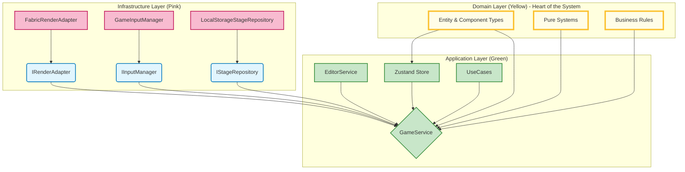
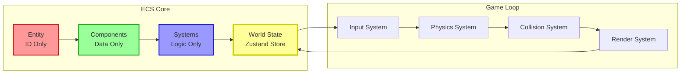
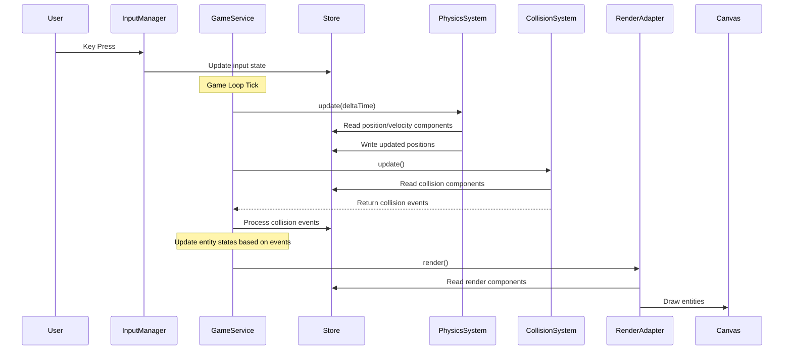

# Architecture Guide - Jumping Dot Game (ECS・DDD・オニオンアーキテクチャ)

## 🎯 Design Philosophy

This project follows **Entity-Component-System (ECS)**, **Domain-Driven Design (DDD)**, and **Onion Architecture** principles to create a maintainable, extensible, and testable game system.

### Core Principles

1. **ECS Architecture**: Composition over inheritance, data-driven design
2. **Domain-Driven Design**: Business logic isolation, ubiquitous language
3. **Onion Architecture**: Dependency inversion, infrastructure isolation
4. **Test-Driven Development**: Tests first, implementation follows
5. **Type Safety**: TypeScript strict mode, comprehensive JSDoc
6. **Single Responsibility**: Each component has one clear purpose

---

## 🏗️ System Architecture Overview

### Onion Architecture Layers



**Dependency Direction**: Infrastructure → Application → Domain (Outside → Inside)

### ECS Architecture Integration



---

## 📁 Directory Structure

### New Architecture-Driven Structure

```
src/
├── app/                  # 🟢 Application Layer
│   ├── usecases/         # Use cases (StartGame, SelectTool)
│   │   ├── StartGame.ts
│   │   ├── LoadStage.ts
│   │   └── CreateObject.ts
│   └── services/         # Application services
│       ├── GameService.ts     # Game progression management
│       └── EditorService.ts   # Editor operation management
│
├── core/                 # 🟡 Domain Layer - ★ Heart of the System ★
│   ├── entities.ts       # Entity definitions and factory functions
│   ├── components.ts     # Component type definitions (data only)
│   ├── systems/          # Pure logic systems (stateless)
│   │   ├── PhysicsSystem.ts
│   │   ├── CollisionSystem.ts
│   │   ├── AnimationSystem.ts
│   │   ├── MovingPlatformSystem.ts
│   │   └── RenderSystem.ts
│   └── store.ts          # Zustand store definition and actions
│
├── infrastructure/       # 🩷 Infrastructure Layer
│   ├── rendering/        # Rendering implementations
│   │   ├── IRenderAdapter.ts      # Abstract interface
│   │   ├── FabricRenderAdapter.ts # Fabric.js implementation
│   │   └── MockRenderAdapter.ts   # Testing implementation
│   ├── input/           # Input implementations
│   │   ├── IInputManager.ts
│   │   └── GameInputManager.ts
│   └── storage/         # Data persistence
│       ├── IStageRepository.ts
│       └── LocalStorageStageRepository.ts
│
├── presentation/        # 🔵 Presentation Layer
│   ├── views/          # View components
│   │   ├── EditorView.ts
│   │   └── GameUI.ts
│   ├── main.ts         # Game application entry point
│   └── editor.ts       # Editor application entry point
│
├── shared/             # 🟤 Shared Resources
│   ├── constants/      # Constants and configuration
│   │   └── GameConstants.ts
│   └── utils/          # Pure utility functions
│       ├── GameUtils.ts
│       └── ErrorHandler.ts
│
└── test/               # 🔸 Test Code
    ├── app/
    ├── core/
    ├── infrastructure/
    └── ...
```

### Layer Responsibilities

| Layer | Color | Responsibility | Dependencies |
|-------|-------|---------------|--------------|
| **Domain** | 🟡 Yellow | Business logic, entities, pure systems | **None** |
| **Application** | 🟢 Green | Use cases, application services | Domain only |
| **Infrastructure** | 🩷 Pink | External integrations, concrete implementations | Application interfaces |
| **Presentation** | 🔵 Blue | UI, user interaction | Application services |

---

## 🎮 ECS Architecture Deep Dive

### Entity-Component-System Principles

#### Entities: Just IDs
```typescript
/**
 * @module core/entities
 * @description Entity management and factory functions for game objects.
 *              Domain Layer - depends on nothing.
 */

export type Entity = number;

/**
 * Creates a new player entity with required components.
 */
export function createPlayer(position: { x: number; y: number }): Entity {
    const entity = actions.createEntity();
    
    actions.addComponent(entity, 'position', position);
    actions.addComponent(entity, 'velocity', { vx: 0, vy: 0 });
    actions.addComponent(entity, 'physics', { grounded: false, mass: 1 });
    actions.addComponent(entity, 'render', { 
        radius: 15, 
        color: '#ff4444', 
        shape: 'circle' 
    });
    
    return entity;
}

/**
 * Creates a platform entity with collision components.
 */
export function createPlatform(start: Point, end: Point): Entity {
    const entity = actions.createEntity();
    
    actions.addComponent(entity, 'position', start);
    actions.addComponent(entity, 'platform', { x1: start.x, y1: start.y, x2: end.x, y2: end.y });
    actions.addComponent(entity, 'collision', { shape: 'line' });
    actions.addComponent(entity, 'render', { 
        color: '#00ff00', 
        shape: 'line',
        width: 3 
    });
    
    return entity;
}
```

#### Components: Pure Data
```typescript
/**
 * @module core/components
 * @description Component type definitions for ECS architecture.
 *              Domain Layer - pure data structures.
 */

export interface PositionComponent {
    x: number;
    y: number;
}

export interface VelocityComponent {
    vx: number;
    vy: number;
}

export interface PhysicsComponent {
    grounded: boolean;
    mass: number;
    gravity?: number;
}

export interface RenderComponent {
    radius?: number;
    color: string;
    shape: 'circle' | 'rect' | 'line';
    width?: number;
    height?: number;
}

export interface MovingPlatformComponent {
    startX: number;
    endX: number;
    speed: number;
    direction: 1 | -1;
}

export interface CollisionComponent {
    shape: 'circle' | 'rect' | 'line';
    bounds?: {
        x1: number;
        y1: number;
        x2: number;
        y2: number;
    };
}

export interface PlatformComponent {
    x1: number;
    y1: number;
    x2: number;
    y2: number;
}
```

#### Systems: Pure Logic
```typescript
/**
 * @module core/systems
 * @description Pure logic systems for ECS architecture.
 *              Domain Layer - stateless, side-effect free.
 */

/**
 * Physics system handles gravity and movement calculations.
 * Stateless - reads from store, calculates, writes back.
 */
export class PhysicsSystem {
    /**
     * Updates physics for all entities with position and velocity components.
     * @param deltaTime - Time elapsed since last update in milliseconds
     */
    update(deltaTime: number): void {
        const state = gameStore.getState();
        const dtFactor = deltaTime / 16.67; // Normalize to 60fps
        
        // Process all entities with position + velocity + physics
        for (const entity of state.entities) {
            const pos = state.components.position.get(entity);
            const vel = state.components.velocity.get(entity);
            const phy = state.components.physics.get(entity);
            
            if (!pos || !vel || !phy) continue;
            
            // Apply gravity if not grounded
            if (!phy.grounded) {
                vel.vy += PHYSICS_CONSTANTS.gravity * dtFactor;
            }
            
            // Update position based on velocity
            pos.x += vel.vx * dtFactor;
            pos.y += vel.vy * dtFactor;
        }
    }
}

/**
 * Collision system generates collision events between entities.
 * Returns events for GameService to process.
 */
export class CollisionSystem {
    /**
     * Checks all entity pairs for collisions and generates events.
     * @returns Array of collision events to be processed
     */
    update(): CollisionEvent[] {
        const events: CollisionEvent[] = [];
        const state = gameStore.getState();
        
        const entities = Array.from(state.entities);
        
        // Check all entity pairs for collisions
        for (let i = 0; i < entities.length; i++) {
            for (let j = i + 1; j < entities.length; j++) {
                const entityA = entities[i];
                const entityB = entities[j];
                
                const collisionEvent = this.checkEntityCollision(entityA, entityB);
                if (collisionEvent) {
                    events.push(collisionEvent);
                }
            }
        }
        
        return events;
    }
    
    /**
     * Checks collision between two specific entities.
     * @private
     */
    private checkEntityCollision(entityA: Entity, entityB: Entity): CollisionEvent | null {
        const state = gameStore.getState();
        
        const posA = state.components.position.get(entityA);
        const posB = state.components.position.get(entityB);
        const collisionA = state.components.collision.get(entityA);
        const collisionB = state.components.collision.get(entityB);
        
        if (!posA || !posB || !collisionA || !collisionB) return null;
        
        // Collision detection logic based on component shapes
        const isColliding = this.detectCollision(posA, collisionA, posB, collisionB);
        
        if (isColliding) {
            return {
                entityA,
                entityB,
                type: this.determineCollisionType(entityA, entityB),
                point: { x: (posA.x + posB.x) / 2, y: (posA.y + posB.y) / 2 }
            };
        }
        
        return null;
    }
}
```

---

## 🗄️ State Management (Zustand + ECS)

### ECS-Optimized Store Structure
```typescript
/**
 * @module core/store
 * @description Zustand store for ECS world state management.
 *              Domain Layer - centralized game state.
 */

import { create } from 'zustand';
import { immer } from 'zustand/middleware/immer';
import { devtools } from 'zustand/middleware';

export interface GameState {
    // ECS World
    nextEntityID: number;
    entities: Set<Entity>;
    components: {
        position: Map<Entity, PositionComponent>;
        velocity: Map<Entity, VelocityComponent>;
        physics: Map<Entity, PhysicsComponent>;
        render: Map<Entity, RenderComponent>;
        collision: Map<Entity, CollisionComponent>;
        platform: Map<Entity, PlatformComponent>;
        movingPlatform: Map<Entity, MovingPlatformComponent>;
        // Add more component maps as needed
    };
    
    // Game State
    currentStage: number;
    gameStatus: 'menu' | 'playing' | 'paused' | 'gameOver';
    score: number;
    timeRemaining: number;
    
    // Editor State
    editor: {
        selectedTool: string;
        selectedEntity: Entity | null;
        gridEnabled: boolean;
        snapToGrid: boolean;
    };
}

export const gameStore = create<GameState>()(
    devtools(
        immer((set, get) => ({
            // Initial ECS World
            nextEntityID: 0,
            entities: new Set(),
            components: {
                position: new Map(),
                velocity: new Map(),
                physics: new Map(),
                render: new Map(),
                collision: new Map(),
                platform: new Map(),
                movingPlatform: new Map(),
            },
            
            // Initial Game State
            currentStage: 1,
            gameStatus: 'menu',
            score: 0,
            timeRemaining: 0,
            
            // Initial Editor State
            editor: {
                selectedTool: 'select',
                selectedEntity: null,
                gridEnabled: true,
                snapToGrid: true,
            }
        })),
        { name: 'jumping-dot-game-store' }
    )
);

/**
 * ECS Actions for entity and component management.
 */
export const actions = {
    /**
     * Creates a new entity and returns its ID.
     */
    createEntity: (): Entity => {
        const state = gameStore.getState();
        const id = state.nextEntityID;
        
        gameStore.setState(draft => {
            draft.entities.add(id);
            draft.nextEntityID++;
        });
        
        return id;
    },
    
    /**
     * Adds a component to an entity.
     */
    addComponent: <T>(
        entity: Entity, 
        componentName: keyof GameState['components'], 
        data: T
    ): void => {
        gameStore.setState(draft => {
            (draft.components[componentName] as Map<Entity, T>).set(entity, data);
        });
    },
    
    /**
     * Removes a component from an entity.
     */
    removeComponent: (
        entity: Entity, 
        componentName: keyof GameState['components']
    ): void => {
        gameStore.setState(draft => {
            draft.components[componentName].delete(entity);
        });
    },
    
    /**
     * Removes an entity and all its components.
     */
    removeEntity: (entity: Entity): void => {
        gameStore.setState(draft => {
            draft.entities.delete(entity);
            
            // Remove from all component maps
            Object.values(draft.components).forEach(componentMap => {
                componentMap.delete(entity);
            });
        });
    },
    
    /**
     * Gets a component for an entity.
     */
    getComponent: <T>(
        entity: Entity, 
        componentName: keyof GameState['components']
    ): T | undefined => {
        const state = gameStore.getState();
        return (state.components[componentName] as Map<Entity, T>).get(entity);
    }
};
```

---

## 🔄 Data Flow Architecture

### Game Loop Data Flow


### Benefits of This Data Flow

1. **Unidirectional Data Flow**: Clear data movement direction
2. **Centralized State**: All game state in one store
3. **Event-Driven**: Systems communicate through events
4. **Testable**: Each system can be tested in isolation
5. **Debuggable**: Redux DevTools support for state inspection

---

## 🏛️ Application Layer (Services & Use Cases)

### GameService: Application Orchestrator
```typescript
/**
 * @module app/services
 * @description Application services for game and editor functionality.
 *              Application Layer - orchestrates domain logic.
 */

/**
 * Main game service that orchestrates all systems and handles game logic.
 * Application Layer - depends only on Domain Layer.
 */
export class GameService {
    private physicsSystem: PhysicsSystem;
    private collisionSystem: CollisionSystem;
    private movingPlatformSystem: MovingPlatformSystem;
    private renderAdapter: IRenderAdapter;
    
    constructor(renderAdapter: IRenderAdapter) {
        this.physicsSystem = new PhysicsSystem();
        this.collisionSystem = new CollisionSystem();
        this.movingPlatformSystem = new MovingPlatformSystem();
        this.renderAdapter = renderAdapter;
    }
    
    /**
     * Main game loop update method.
     * @param deltaTime - Time elapsed since last update
     */
    update(deltaTime: number): void {
        // 1. Update moving platforms
        this.movingPlatformSystem.update(deltaTime);
        
        // 2. Apply physics
        this.physicsSystem.update(deltaTime);
        
        // 3. Check collisions and process events
        const collisionEvents = this.collisionSystem.update();
        this.processCollisionEvents(collisionEvents);
        
        // 4. Render everything
        this.renderAdapter.renderAll();
    }
    
    /**
     * Processes collision events and updates game state accordingly.
     * @private
     */
    private processCollisionEvents(events: CollisionEvent[]): void {
        for (const event of events) {
            switch (event.type) {
                case 'player-platform':
                    this.handlePlayerPlatformCollision(event);
                    break;
                case 'player-spike':
                    this.handlePlayerSpikeCollision(event);
                    break;
                case 'player-goal':
                    this.handlePlayerGoalCollision(event);
                    break;
            }
        }
    }
    
    /**
     * Handles collision between player and platform.
     * @private
     */
    private handlePlayerPlatformCollision(event: CollisionEvent): void {
        const playerEntity = this.identifyPlayer(event.entityA, event.entityB);
        const platformEntity = playerEntity === event.entityA ? event.entityB : event.entityA;
        
        // Update player physics state
        actions.addComponent(playerEntity, 'physics', { grounded: true, mass: 1 });
        
        // Stop downward velocity
        const velocity = actions.getComponent<VelocityComponent>(playerEntity, 'velocity');
        if (velocity && velocity.vy > 0) {
            velocity.vy = 0;
        }
        
        // If platform is moving, add platform velocity to player
        const movingPlatform = actions.getComponent<MovingPlatformComponent>(platformEntity, 'movingPlatform');
        if (movingPlatform && velocity) {
            velocity.vx += movingPlatform.speed * movingPlatform.direction;
        }
    }
}
```

### Use Cases: Business Operations
```typescript
/**
 * @module app/usecases
 * @description Use case implementations for game operations.
 *              Application Layer - business operation orchestration.
 */

/**
 * Use case for starting a new game with a specific stage.
 */
export class StartGameUseCase {
    private stageRepository: IStageRepository;
    
    constructor(stageRepository: IStageRepository) {
        this.stageRepository = stageRepository;
    }
    
    /**
     * Starts a new game with the specified stage.
     * @param stageId - Stage ID to load
     */
    async execute(stageId: number): Promise<void> {
        // 1. Clear existing game state
        this.clearGameWorld();
        
        // 2. Load stage data
        const stageData = await this.stageRepository.loadStage(stageId);
        
        // 3. Create game entities from stage data
        const playerEntity = createPlayer(stageData.playerStart);
        
        stageData.platforms.forEach(platformData => {
            createPlatform(
                { x: platformData.x1, y: platformData.y1 },
                { x: platformData.x2, y: platformData.y2 }
            );
        });
        
        stageData.movingPlatforms?.forEach(movingPlatformData => {
            const entity = createMovingPlatform(movingPlatformData);
        });
        
        // 4. Update game state
        gameStore.setState(draft => {
            draft.currentStage = stageId;
            draft.gameStatus = 'playing';
            draft.timeRemaining = stageData.timeLimit || 60;
        });
    }
    
    /**
     * Clears all entities from the game world.
     * @private
     */
    private clearGameWorld(): void {
        const state = gameStore.getState();
        const entities = Array.from(state.entities);
        
        entities.forEach(entity => {
            actions.removeEntity(entity);
        });
    }
}
```

---

## 🏗️ Infrastructure Layer

### Render Adapter: External Integration
```typescript
/**
 * @module infrastructure/rendering
 * @description Rendering infrastructure implementations.
 *              Infrastructure Layer - depends on Application interfaces.
 */

/**
 * Abstract render adapter interface.
 * Defined in Application Layer, implemented in Infrastructure Layer.
 */
export interface IRenderAdapter {
    initialize(canvas: HTMLCanvasElement): Promise<void>;
    renderAll(): void;
    clear(): void;
    dispose(): void;
}

/**
 * Fabric.js implementation of render adapter.
 * Infrastructure Layer - concrete implementation.
 */
export class FabricRenderAdapter implements IRenderAdapter {
    private canvas: fabric.Canvas | null = null;
    private entityRenderMap = new Map<Entity, fabric.Object>();
    
    /**
     * Initializes Fabric.js canvas.
     */
    async initialize(canvasElement: HTMLCanvasElement): Promise<void> {
        this.canvas = new fabric.Canvas(canvasElement);
        this.setupCanvasProperties();
    }
    
    /**
     * Renders all entities with render components.
     */
    renderAll(): void {
        if (!this.canvas) return;
        
        const state = gameStore.getState();
        
        // Clear canvas
        this.canvas.clear();
        
        // Render all entities with render components
        for (const entity of state.entities) {
            const position = state.components.position.get(entity);
            const render = state.components.render.get(entity);
            
            if (position && render) {
                this.renderEntity(entity, position, render);
            }
        }
        
        this.canvas.renderAll();
    }
    
    /**
     * Renders a single entity based on its components.
     * @private
     */
    private renderEntity(
        entity: Entity, 
        position: PositionComponent, 
        render: RenderComponent
    ): void {
        if (!this.canvas) return;
        
        let fabricObject: fabric.Object;
        
        switch (render.shape) {
            case 'circle':
                fabricObject = new fabric.Circle({
                    left: position.x - (render.radius || 10),
                    top: position.y - (render.radius || 10),
                    radius: render.radius || 10,
                    fill: render.color,
                    selectable: false
                });
                break;
                
            case 'rect':
                fabricObject = new fabric.Rect({
                    left: position.x,
                    top: position.y,
                    width: render.width || 20,
                    height: render.height || 20,
                    fill: render.color,
                    selectable: false
                });
                break;
                
            case 'line':
                const platform = gameStore.getState().components.platform.get(entity);
                if (platform) {
                    fabricObject = new fabric.Line([
                        platform.x1, platform.y1, 
                        platform.x2, platform.y2
                    ], {
                        stroke: render.color,
                        strokeWidth: render.width || 3,
                        selectable: false
                    });
                } else {
                    return;
                }
                break;
                
            default:
                return;
        }
        
        this.canvas.add(fabricObject);
        this.entityRenderMap.set(entity, fabricObject);
    }
}
```

---

## 🧪 Testing Strategy

### Test-Driven Development (TDD) Approach

#### 1. Component Tests (Pure Data)
```typescript
/**
 * @module test/core
 * @description Tests for ECS components and entities.
 */

describe('ECS Components', () => {
    describe('Entity Creation', () => {
        it('should create unique entity IDs', () => {
            const entity1 = actions.createEntity();
            const entity2 = actions.createEntity();
            
            expect(entity1).not.toBe(entity2);
            expect(typeof entity1).toBe('number');
            expect(typeof entity2).toBe('number');
        });
    });
    
    describe('Component Management', () => {
        it('should add and retrieve components correctly', () => {
            const entity = actions.createEntity();
            const position: PositionComponent = { x: 100, y: 200 };
            
            actions.addComponent(entity, 'position', position);
            const retrieved = actions.getComponent<PositionComponent>(entity, 'position');
            
            expect(retrieved).toEqual(position);
        });
        
        it('should remove components correctly', () => {
            const entity = actions.createEntity();
            const velocity: VelocityComponent = { vx: 10, vy: -5 };
            
            actions.addComponent(entity, 'velocity', velocity);
            actions.removeComponent(entity, 'velocity');
            const retrieved = actions.getComponent<VelocityComponent>(entity, 'velocity');
            
            expect(retrieved).toBeUndefined();
        });
    });
});
```

#### 2. System Tests (Pure Logic)
```typescript
describe('PhysicsSystem', () => {
    let physicsSystem: PhysicsSystem;
    
    beforeEach(() => {
        physicsSystem = new PhysicsSystem();
        // Clear store
        gameStore.setState(draft => {
            draft.entities.clear();
            Object.values(draft.components).forEach(map => map.clear());
        });
    });
    
    it('should apply gravity to non-grounded entities', () => {
        // Arrange
        const entity = actions.createEntity();
        actions.addComponent(entity, 'position', { x: 0, y: 0 });
        actions.addComponent(entity, 'velocity', { vx: 0, vy: 0 });
        actions.addComponent(entity, 'physics', { grounded: false, mass: 1 });
        
        // Act
        physicsSystem.update(16.67); // One frame at 60fps
        
        // Assert
        const velocity = actions.getComponent<VelocityComponent>(entity, 'velocity');
        expect(velocity?.vy).toBeGreaterThan(0); // Gravity applied
    });
    
    it('should not apply gravity to grounded entities', () => {
        // Arrange
        const entity = actions.createEntity();
        actions.addComponent(entity, 'position', { x: 0, y: 0 });
        actions.addComponent(entity, 'velocity', { vx: 0, vy: 0 });
        actions.addComponent(entity, 'physics', { grounded: true, mass: 1 });
        
        // Act
        physicsSystem.update(16.67);
        
        // Assert
        const velocity = actions.getComponent<VelocityComponent>(entity, 'velocity');
        expect(velocity?.vy).toBe(0); // No gravity applied
    });
});
```

#### 3. Integration Tests (Service Layer)
```typescript
describe('GameService Integration', () => {
    let gameService: GameService;
    let mockRenderAdapter: MockRenderAdapter;
    
    beforeEach(() => {
        mockRenderAdapter = new MockRenderAdapter();
        gameService = new GameService(mockRenderAdapter);
    });
    
    it('should complete a full game loop update', () => {
        // Arrange: Create a simple game world
        const player = createPlayer({ x: 100, y: 100 });
        const platform = createPlatform({ x: 0, y: 200 }, { x: 200, y: 200 });
        
        // Act: Run one game loop iteration
        gameService.update(16.67);
        
        // Assert: Systems should have executed
        expect(mockRenderAdapter.renderAllCalled).toBe(true);
        
        // Player should have moved due to physics
        const playerPos = actions.getComponent<PositionComponent>(player, 'position');
        expect(playerPos?.y).toBeGreaterThan(100); // Gravity applied
    });
});
```

### Mock Strategy for External Dependencies
```typescript
/**
 * Mock implementations for testing.
 */
export class MockRenderAdapter implements IRenderAdapter {
    public renderAllCalled = false;
    public clearCalled = false;
    
    async initialize(canvas: HTMLCanvasElement): Promise<void> {
        // Mock implementation
    }
    
    renderAll(): void {
        this.renderAllCalled = true;
    }
    
    clear(): void {
        this.clearCalled = true;
    }
    
    dispose(): void {
        // Mock implementation
    }
}
```

---

## 📈 Performance Optimization

### ECS Performance Benefits

1. **Data Locality**: Components stored in contiguous arrays (Maps)
2. **Cache Efficiency**: Systems process similar data together
3. **Parallel Processing**: Systems can run independently
4. **Memory Management**: Easy entity lifecycle management

### Optimization Strategies

```typescript
/**
 * Performance-optimized system base class.
 */
abstract class OptimizedSystem {
    protected lastUpdateTime = 0;
    protected updateInterval = 16.67; // 60fps
    
    /**
     * Update method with built-in performance monitoring.
     */
    update(deltaTime: number): void {
        const startTime = performance.now();
        
        this.performUpdate(deltaTime);
        
        const endTime = performance.now();
        this.recordPerformanceMetric(endTime - startTime);
    }
    
    protected abstract performUpdate(deltaTime: number): void;
    
    private recordPerformanceMetric(executionTime: number): void {
        // Performance monitoring logic
        if (executionTime > this.updateInterval) {
            console.warn(`${this.constructor.name} took ${executionTime}ms (target: ${this.updateInterval}ms)`);
        }
    }
}
```

---

## 🔧 Development Workflow

### Phase-by-Phase Implementation Plan

#### Phase 1: Foundation (1-2 days)
- [ ] Directory restructuring
- [ ] Basic ECS types and store
- [ ] Entity factory functions

#### Phase 2: Domain Layer (3-5 days)
- [ ] Component type definitions
- [ ] Pure system implementations
- [ ] Store actions and queries
- [ ] **TDD**: Write tests first, implement after

#### Phase 3: Application Layer (3-5 days)
- [ ] GameService implementation
- [ ] Use case implementations
- [ ] Event processing logic
- [ ] **TDD**: Service and use case tests

#### Phase 4: Infrastructure (2-3 days)
- [ ] Render adapter refactoring
- [ ] Input manager restructuring
- [ ] Repository implementations

#### Phase 5: Feature Implementation (2-3 days)
- [ ] Moving platform system
- [ ] Enhanced collision detection
- [ ] Game progression logic
- [ ] **TDD**: Feature tests and implementation

### Git Workflow
```bash
# Start new phase
git checkout main
git pull origin main
git checkout -b phase-1/ecs-foundation

# Development with frequent commits
git add .
git commit -m "feat: implement entity factory functions

- Add createPlayer and createPlatform functions
- Include component attachment logic
- Follow TDD approach with tests first

🤖 Generated with [Claude Code](https://claude.ai/code)

Co-Authored-By: Claude <noreply@anthropic.com>"

# Create PR when phase complete
gh pr create --base main --title "Phase 1: ECS Foundation" --body "
## Summary
- Implemented ECS foundation with entity factories
- Created component type definitions
- Set up Zustand store for ECS data

## Test Plan
- [x] Entity creation tests
- [x] Component management tests
- [x] Store integration tests

🤖 Generated with [Claude Code](https://claude.ai/code)
"
```

---

## 📚 References and Resources

### Architecture Patterns
- **ECS**: [Entity Component System Architecture](https://en.wikipedia.org/wiki/Entity_component_system)
- **DDD**: [Domain-Driven Design by Eric Evans](https://domainlanguage.com/ddd/)
- **Onion Architecture**: [The Onion Architecture by Jeffrey Palermo](https://jeffreypalermo.com/2008/07/the-onion-architecture-part-1/)

### Implementation Technologies
- **Zustand**: [State Management](https://zustand-demo.pmnd.rs/)
- **TypeScript**: [Strict Mode Configuration](https://www.typescriptlang.org/tsconfig#strict)
- **Vitest**: [Testing Framework](https://vitest.dev/)
- **Fabric.js**: [Canvas Library](http://fabricjs.com/)

### Project-Specific Documentation
- `CONTRIBUTING.md` - Development guidelines
- `CODE_OF_CONDUCT.md` - Community guidelines
- `README.md` - Project overview
- `.claude/task-roadmap.md` - Implementation roadmap

---

## 🎯 Summary

This architecture represents a **complete transformation** from OOP to **ECS + DDD + Onion Architecture**. The design prioritizes:

1. **Maintainability**: Clear separation of concerns across layers
2. **Testability**: Pure functions and dependency injection
3. **Extensibility**: Easy addition of new systems and components
4. **Performance**: Data-oriented design with optimal memory usage
5. **Robustness**: Comprehensive error handling and type safety

The **Entity-Component-System** provides flexible game object composition, **Domain-Driven Design** ensures business logic clarity, and **Onion Architecture** maintains proper dependency direction.

This foundation will support the jumping dot game's growth from a simple platformer to a complex, feature-rich gaming experience.

---

*Last Updated: 2025-06-18*  
*Architecture Reviewer: ナナちゃん 🐺*  
*Implementation Lead: ねつき 🦊*