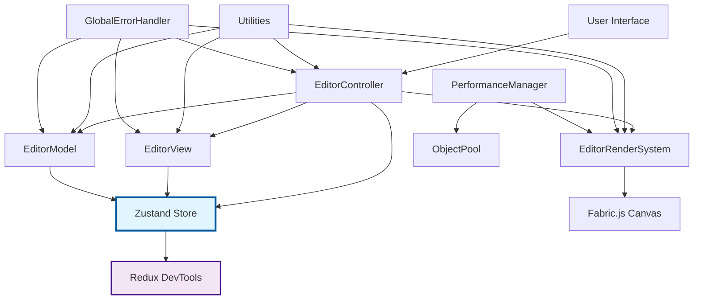
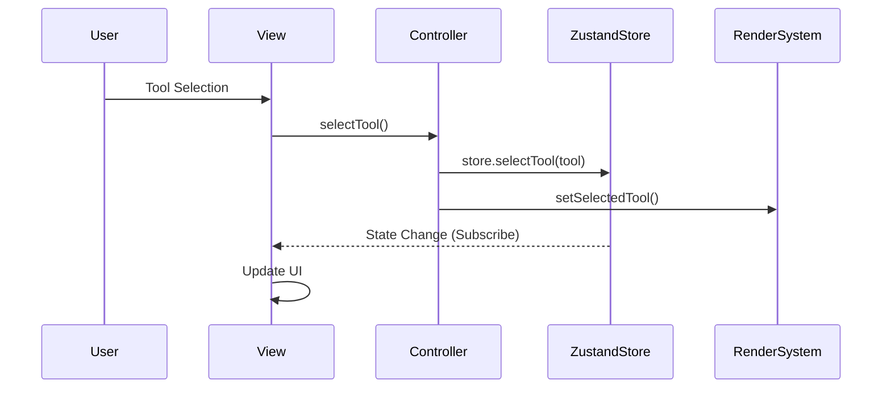
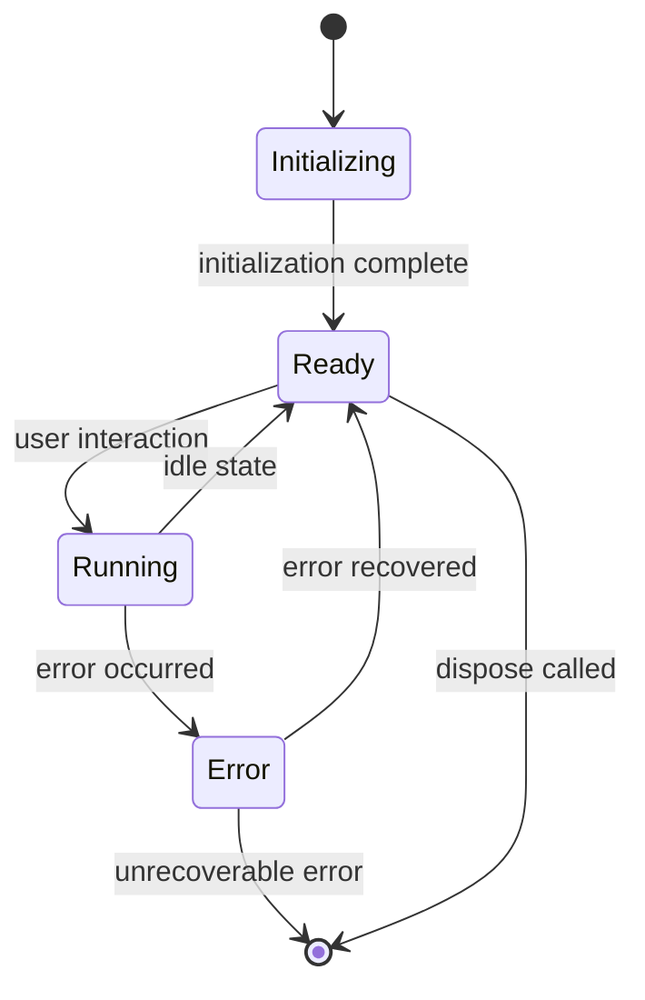

# Architecture Guide - Jumping Dot Game Editor

## System Design Overview

### Design Principles

1. **Separation of Concerns**: Responsibility separation through MVC pattern
2. **Type Safety**: Type checking with TypeScript strict mode
3. **Testability**: Dependency injection and mocking support
4. **Extensibility**: Plugin and module-oriented design
5. **Performance**: Object pooling and optimization
6. **Error Handling**: Unified error handling system

---

## Architecture Overview



---

## MVC Architecture Details

### Model Layer - Data Management

**Responsibilities**: Business data management, persistence, validation

#### EditorModel
```typescript
class EditorModel implements IEditorModel {
    private currentStage: StageData | null = null;
    private editorState: EditorState;
    private changeListeners: ChangeListener[] = [];
    
    // Data operations
    public getCurrentStage(): StageData | null
    public setCurrentStage(stageData: StageData): void
    public validateStageData(stageData: StageData): boolean
    
    // State management
    public getEditorState(): EditorState
    public updateEditorState(updates: Partial<EditorState>): void
    
    // Serialization
    public exportStageAsJson(): string
    public importStageFromJson(json: string): StageData
}
```

**Features**:
- Immutable data management
- Reactive change notifications
- JSON/binary serialization
- Data integrity validation

### View Layer - Presentation

**Responsibilities**: User interface management, event handling

#### EditorView
```typescript
class EditorView implements IEditorView {
    private canvas: HTMLCanvasElement;
    private controller: IEditorController | null = null;
    private uiElements: UIElementMap;
    
    // UI updates
    public updateToolSelection(tool: string): void
    public updateObjectCount(count: number): void
    public showObjectProperties(object: FabricObjectWithData | null): void
    
    // Message display
    public showErrorMessage(message: string): void
    public showSuccessMessage(message: string): void
    
    // Event handling
    private setupEventListeners(): void
    private handleToolSelection(tool: string): void
}
```

**Features**:
- Centralized DOM operations
- Event delegation
- Responsive UI support
- Accessibility considerations

### Controller Layer - Business Logic

**Responsibilities**: User action coordination, business rule implementation, state management integration

#### EditorController
```typescript
class EditorController implements IEditorController {
    private editorSystem: EditorRenderSystem;
    private view: IEditorView;
    private model: IEditorModel;
    private store: ReturnType<typeof useEditorStore.getState>;
    private unsubscribe: () => void;
    
    constructor(
        canvas: HTMLCanvasElement,
        view: IEditorView,
        model: IEditorModel
    ) {
        this.store = useEditorStore.getState();
        
        // Subscribe to Zustand store
        this.unsubscribe = useEditorStore.subscribe((state) => {
            this.handleStateChange(state);
        });
    }
    
    // Core functionality
    public async initialize(): Promise<void>
    public selectTool(tool: string): void {
        this.store.selectTool(tool);
        this.editorSystem.selectTool(tool);
    }
    public createNewStage(): void {
        const newStage = this.model.createDefaultStage();
        this.store.setStageData(newStage);
    }
    public saveStage(): void
    
    // Object operations
    public deleteSelectedObject(): void
    public duplicateSelectedObject(): void
    
    // State management
    public toggleGrid(): void {
        this.store.toggleGrid();
        this.editorSystem.setGridEnabled(this.store.editor.gridEnabled);
    }
    
    // Event handling
    private handleObjectSelection(object: FabricObjectWithData | null): void {
        this.store.setSelectedObject(object);
    }
    private handleKeyboard(e: KeyboardEvent): void
    private handleStateChange(state: EditorStore): void
    
    public dispose(): void {
        this.unsubscribe?.();
    }
}
```

**Features**:
- Asynchronous operation control
- Complex business rule implementation
- **Zustand integration for unified state management**
- **Reactive state synchronization**
- Cross-cutting concern coordination
- External system integration

---

## Rendering System

### Hierarchy Structure

```
RenderSystem (abstract base)
├── FabricRenderSystem (Fabric.js integration)
└── EditorRenderSystem (editor extensions)
    ├── Grid Management
    ├── Object Creation
    ├── Selection Handling
    └── Export/Import
```

### EditorRenderSystem Design

```typescript
class EditorRenderSystem extends FabricRenderSystem {
    // State management
    private editorState: EditorState;
    private callbacks: EditorCallbacks;
    
    // Rendering
    protected renderGrid(): void
    protected renderEditableObjects(stageData: StageData): void
    
    // Interaction
    private handleMouseDown(e: fabric.IEvent): void
    private handleObjectSelection(object: fabric.Object | null): void
    
    // Object management
    public createSpike(x: number, y: number): void
    public createGoal(x: number, y: number): void
    public duplicateObject(original: FabricObjectWithData): FabricObjectWithData
}
```

**Optimization Points**:
- **Layer Separation**: Separate rendering of UI/game elements
- **Object Pooling**: Optimize frequent creation/deletion
- **Batch Processing**: Bulk operations on multiple objects
- **Differential Updates**: Re-render only changed parts

---

## State Management System

### Zustand-Based Architecture

```typescript
import { create } from 'zustand';
import { immer } from 'zustand/middleware/immer';
import { devtools } from 'zustand/middleware';

// State Structure
interface EditorStore {
    // State
    editor: EditorState;
    stage: StageData | null;
    ui: UIState;
    performance: PerformanceState;
    
    // Actions
    selectTool: (tool: string) => void;
    setStageData: (stage: StageData) => void;
    updateEditorState: (updates: Partial<EditorState>) => void;
    toggleGrid: () => void;
    toggleSnap: () => void;
    setSelectedObject: (object: FabricObjectWithData | null) => void;
    
    // Computed getters
    getActiveTool: () => string;
    getCurrentStage: () => StageData | null;
    getObjectCount: () => number;
}

// Store Implementation
export const useEditorStore = create<EditorStore>()(
    devtools(
        immer((set, get) => ({
            // Initial State
            editor: {
                selectedTool: 'select',
                selectedObject: null,
                isDrawing: false,
                gridEnabled: true,
                snapToGrid: true
            },
            stage: null,
            ui: {
                isInitialized: false,
                isLoading: false,
                lastError: null,
                lastSuccess: null
            },
            performance: {
                objectCount: 0,
                renderTime: 0,
                lastOperation: ''
            },
            
            // Actions
            selectTool: (tool) => set((state) => {
                state.editor.selectedTool = tool;
            }),
            
            setStageData: (stage) => set((state) => {
                state.stage = stage;
                state.performance.objectCount = 
                    stage.platforms.length + stage.spikes.length + 1;
            }),
            
            updateEditorState: (updates) => set((state) => {
                Object.assign(state.editor, updates);
            }),
            
            toggleGrid: () => set((state) => {
                state.editor.gridEnabled = !state.editor.gridEnabled;
            }),
            
            toggleSnap: () => set((state) => {
                state.editor.snapToGrid = !state.editor.snapToGrid;
            }),
            
            setSelectedObject: (object) => set((state) => {
                state.editor.selectedObject = object;
            }),
            
            // Computed Getters
            getActiveTool: () => get().editor.selectedTool,
            getCurrentStage: () => get().stage,
            getObjectCount: () => get().performance.objectCount
        }))
    )
);
```

### State Synchronization Mechanism



#### Benefits of Zustand Integration

- **Reduced Boilerplate**: 70% code reduction compared to Redux
- **Type Safety**: Full TypeScript support
- **Debug Capabilities**: Redux DevTools support
- **Testability**: Simple mock & spy support
- **Bundle Size**: Only 2.2KB (gzipped)
- **Low Learning Curve**: Simple API design

---

## Utility System

### Design Patterns

#### Helper Classes
```typescript
// Static Utility Classes
class TypeHelper {
    static isStageData(data: unknown): data is StageData
    static safeParseInt(value: string, defaultValue: number): number
}

class EventHelper {
    static debounce<T>(func: T, delay: number): T
    static throttle<T>(func: T, delay: number): T
    static normalizeKeyboardEvent(e: KeyboardEvent): string
}

class MathHelper {
    static distance(p1: Point, p2: Point): number
    static angle(p1: Point, p2: Point): number
    static snapToGrid(point: Point, gridSize: number): Point
}
```

#### Factory Pattern
```typescript
class ObjectFactory {
    static createSpike(params: ObjectCreationParams): fabric.Polygon
    static createGoal(params: ObjectCreationParams): fabric.Rect
    static createPlatform(start: Point, end: Point): fabric.Line
    static createText(params: ObjectCreationParams): fabric.Text
    
    private static applyCommonProperties(object: fabric.Object): void
    private static generateObjectId(): string
}
```

---

## Performance Optimization

### Object Pool Pattern

```typescript
class ObjectPool<T> {
    private available: T[] = [];
    private inUse = new Set<T>();
    
    public acquire(): T | null
    public release(object: T): void
    public getStats(): PoolStats
    
    private createObject(): T
    private resetObject(object: T): void
}

// Specialized pool
class SpikePool extends ObjectPool<fabric.Polygon> {
    protected createObject(): fabric.Polygon {
        return ObjectFactory.createSpike({
            position: { x: 0, y: 0 }
        });
    }
}
```

### Memory Management

```typescript
class PerformanceManager {
    private pools: Map<string, ObjectPool<any>>;
    private memoryUsage: MemoryTracker;
    
    public createOptimizedSpike(position: Point): fabric.Polygon
    public releaseObject(object: fabric.Object): void
    public getPerformanceStats(): PerformanceStats
    
    private monitorMemoryUsage(): void
    private triggerGarbageCollection(): void
}
```

### Optimization Targets

| Metric | Target | Measurement |
|--------|--------|-------------|
| FPS | 60fps | `performance.now()` |
| Memory Usage | <50MB | `performance.memory` |
| Object Creation Time | <16ms | Profiler |
| Initialization Time | <3s | Time measurement |

---

## Error Handling

### Error Hierarchy

```typescript
// Base Error Class
class EditorError extends Error {
    constructor(
        message: string,
        public readonly code: ErrorCode,
        public readonly type: ErrorType,
        public readonly details?: any,
        public readonly recoverable: boolean = true
    ) {
        super(message);
        this.name = 'EditorError';
    }
    
    public getUserMessage(): string
    public toJSON(): ErrorDetails
}

// Specialized Errors
class CanvasError extends EditorError {
    constructor(message: string, details?: any) {
        super(message, ERROR_CODES.CANVAS_INIT_FAILED, ERROR_TYPES.FABRIC, details);
    }
}
```

### Global Error Handler

```typescript
class GlobalErrorHandler {
    private reporters: ErrorReporter[] = [];
    private errorStats: ErrorStatistics;
    
    public handleError(error: Error | EditorError): void
    public addReporter(reporter: ErrorReporter): void
    public getErrorStats(): ErrorStatistics
    
    private classifyError(error: Error): EditorError
    private shouldRetry(error: EditorError): boolean
}
```

### Error Recovery Strategies

1. **Minor Errors**: Log only
2. **UI-related Errors**: UI re-initialization
3. **Data Errors**: Restore from backup
4. **System Errors**: Rollback to safe state

---

## Test Architecture

### Test Categories

#### Unit Tests
```typescript
describe('EditorModel', () => {
    let model: EditorModel;
    
    beforeEach(() => {
        model = new EditorModel();
    });
    
    it('should validate stage data correctly', () => {
        const validData: StageData = createMockStageData();
        expect(model.validateStageData(validData)).toBe(true);
    });
});
```

#### Integration Tests
```typescript
describe('Editor Integration', () => {
    let controller: EditorController;
    let view: EditorView;
    let model: EditorModel;
    
    beforeEach(async () => {
        // Setup full MVC stack
        const canvas = createMockCanvas();
        model = new EditorModel();
        view = new EditorView(canvas);
        controller = new EditorController(canvas, view, model);
        
        await controller.initialize();
    });
    
    it('should complete full workflow', async () => {
        // Test complete user workflow
    });
});
```

#### Performance Tests
```typescript
describe('Performance Tests', () => {
    it('should create objects within time limit', () => {
        const startTime = performance.now();
        
        for (let i = 0; i < 100; i++) {
            controller.createObject(mockEvent);
        }
        
        const endTime = performance.now();
        expect(endTime - startTime).toBeLessThan(1000);
    });
});
```

### Mocking Strategy

```typescript
// Canvas Mocking
const createMockCanvas = (): HTMLCanvasElement => {
    const canvas = document.createElement('canvas');
    canvas.getContext = vi.fn().mockReturnValue({
        fillRect: vi.fn(),
        clearRect: vi.fn(),
        // ... other context methods
    });
    return canvas;
};

// Fabric.js Mocking
vi.mock('fabric', () => ({
    Canvas: vi.fn().mockImplementation(() => ({
        add: vi.fn(),
        remove: vi.fn(),
        renderAll: vi.fn(),
        // ... other fabric methods
    }))
}));
```

---

## Extension Points

### Plugin System Design

```typescript
interface EditorPlugin {
    name: string;
    version: string;
    initialize(api: EditorAPI): Promise<void>;
    dispose(): Promise<void>;
}

class PluginManager {
    private plugins = new Map<string, EditorPlugin>();
    
    public async loadPlugin(plugin: EditorPlugin): Promise<void>
    public async unloadPlugin(name: string): Promise<void>
    public getPlugin(name: string): EditorPlugin | undefined
}

// Plugin API
interface EditorAPI {
    // Core functionality exposed to plugins
    createTool(tool: CustomTool): void;
    registerEventHandler(event: string, handler: Function): void;
    accessRenderSystem(): EditorRenderSystem;
}
```

### Custom Tool Framework

```typescript
abstract class CustomTool {
    abstract name: string;
    abstract icon: string;
    
    abstract onSelected(): void;
    abstract onDeselected(): void;
    abstract onMouseDown(event: MouseEvent): void;
    abstract onMouseMove(event: MouseEvent): void;
    abstract onMouseUp(event: MouseEvent): void;
}

// Example: Custom Enemy Tool
class EnemyTool extends CustomTool {
    name = 'enemy';
    icon = '👾';
    
    onMouseDown(event: MouseEvent): void {
        const position = this.getCanvasPosition(event);
        this.createEnemy(position);
    }
    
    private createEnemy(position: Point): void {
        // Enemy creation logic
    }
}
```

---

## Monitoring, Logging, and Metrics

### DebugHelper System

```typescript
class DebugHelper {
    private static logLevel: LogLevel = LogLevel.INFO;
    private static metrics = new Map<string, number>();
    
    public static log(message: string, data?: any): void
    public static time<T>(label: string, operation: () => T): T
    public static recordMetric(name: string, value: number): void
    public static getMetrics(): Map<string, number>
    
    private static formatLogMessage(level: LogLevel, message: string, data?: any): string
}
```

### Performance Monitoring

```typescript
class PerformanceMonitor {
    private fpsCounter: FPSCounter;
    private memoryTracker: MemoryTracker;
    private operationProfiler: OperationProfiler;
    
    public startMonitoring(): void
    public stopMonitoring(): void
    public getReport(): PerformanceReport
    
    private measureFPS(): number
    private trackMemoryUsage(): MemoryUsage
    private profileOperations(): OperationProfile[]
}
```

---

## Lifecycle Management

### Application Lifecycle



### Component Lifecycle

```typescript
interface Disposable {
    dispose(): void;
}

class ComponentManager {
    private components: Disposable[] = [];
    
    public register(component: Disposable): void
    public disposeAll(): void
    
    private setupCleanupHooks(): void
}

// Automatic cleanup on page unload
window.addEventListener('beforeunload', () => {
    globalComponentManager.disposeAll();
});
```

---

## Summary

### Architecture Benefits

1. **Maintainability**: Clear responsibility separation localizes change impact
2. **Testability**: Dependency injection makes unit testing easy
3. **Extensibility**: Plugin system allows safe feature additions  
4. **Performance**: Clear optimization points that are measurable
5. **Robustness**: Comprehensive error handling improves system stability

### Design Decision Rationale

- **MVC Selection**: Separation of UI and business logic, ease of testing
- **TypeScript Adoption**: Type safety for early bug detection
- **Fabric.js Integration**: Abstraction of Canvas operation complexity
- **Object Pooling**: Memory efficiency and GC load reduction
- **Event-Driven**: Loose coupling and extensibility assurance

This design achieves a high-quality, maintainable editor system.