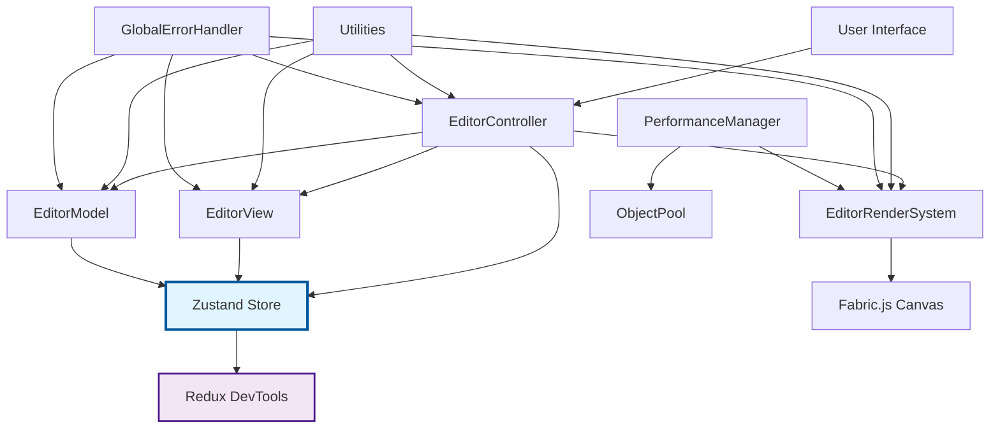
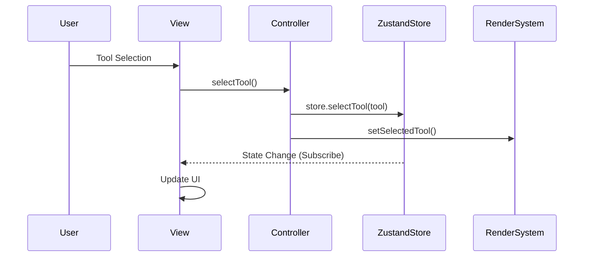
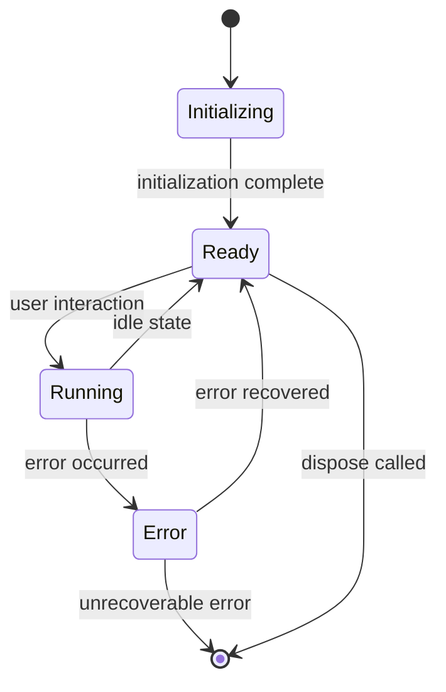

# 🏗️ Architecture Guide - Jumping Dot Game Editor

## 📋 システム全体設計

### 🎯 設計原則

1. **関心の分離**: MVCパターンによる責務分離
2. **型安全性**: TypeScript厳密モードによる型チェック
3. **テスタビリティ**: 依存性注入とモッキング対応
4. **拡張性**: プラグイン・モジュール指向設計
5. **パフォーマンス**: オブジェクトプールと最適化
6. **エラー処理**: 統一的エラーハンドリング

---

## 🏛️ アーキテクチャ概要



---

## 📱 MVCアーキテクチャ詳細

### Model Layer - データ管理層

**責務**: ビジネスデータの管理・永続化・検証

#### EditorModel
```typescript
class EditorModel implements IEditorModel {
    private currentStage: StageData | null = null;
    private editorState: EditorState;
    private changeListeners: ChangeListener[] = [];
    
    // データ操作
    public getCurrentStage(): StageData | null
    public setCurrentStage(stageData: StageData): void
    public validateStageData(stageData: StageData): boolean
    
    // 状態管理
    public getEditorState(): EditorState
    public updateEditorState(updates: Partial<EditorState>): void
    
    // シリアライゼーション
    public exportStageAsJson(): string
    public importStageFromJson(json: string): StageData
}
```

**特徴**:
- 不変性を保持したデータ管理
- リアクティブな変更通知
- JSON/バイナリシリアライゼーション
- データ整合性検証

### View Layer - プレゼンテーション層

**責務**: ユーザーインターフェース管理・イベント処理

#### EditorView
```typescript
class EditorView implements IEditorView {
    private canvas: HTMLCanvasElement;
    private controller: IEditorController | null = null;
    private uiElements: UIElementMap;
    
    // UI更新
    public updateToolSelection(tool: string): void
    public updateObjectCount(count: number): void
    public showObjectProperties(object: FabricObjectWithData | null): void
    
    // メッセージ表示
    public showErrorMessage(message: string): void
    public showSuccessMessage(message: string): void
    
    // イベント処理
    private setupEventListeners(): void
    private handleToolSelection(tool: string): void
}
```

**特徴**:
- DOM操作の集約
- イベントデリゲーション
- レスポンシブUI対応
- アクセシビリティ考慮

### Controller Layer - ビジネスロジック層

**責務**: ユーザーアクション調整・ビジネスルール実装・状態管理統合

#### EditorController
```typescript
class EditorController implements IEditorController {
    private editorSystem: EditorRenderSystem;
    private view: IEditorView;
    private model: IEditorModel;
    private store: ReturnType<typeof useEditorStore.getState>;
    private unsubscribe: () => void;
    
    constructor(
        canvas: HTMLCanvasElement,
        view: IEditorView,
        model: IEditorModel
    ) {
        this.store = useEditorStore.getState();
        
        // Zustandストアの購読
        this.unsubscribe = useEditorStore.subscribe((state) => {
            this.handleStateChange(state);
        });
    }
    
    // コア機能
    public async initialize(): Promise<void>
    public selectTool(tool: string): void {
        this.store.selectTool(tool);
        this.editorSystem.selectTool(tool);
    }
    public createNewStage(): void {
        const newStage = this.model.createDefaultStage();
        this.store.setStageData(newStage);
    }
    public saveStage(): void
    
    // オブジェクト操作
    public deleteSelectedObject(): void
    public duplicateSelectedObject(): void
    
    // 状態管理
    public toggleGrid(): void {
        this.store.toggleGrid();
        this.editorSystem.setGridEnabled(this.store.editor.gridEnabled);
    }
    
    // イベントハンドリング
    private handleObjectSelection(object: FabricObjectWithData | null): void {
        this.store.setSelectedObject(object);
    }
    private handleKeyboard(e: KeyboardEvent): void
    private handleStateChange(state: EditorStore): void
    
    public dispose(): void {
        this.unsubscribe?.();
    }
}
```

**特徴**:
- 非同期処理制御
- 複雑なビジネスルール実装
- **Zustand統合による統一状態管理**
- **リアクティブな状態同期**
- クロスカッティング関心事の調整
- 外部システムとの統合

---

## 🎨 レンダリングシステム

### 階層構造

```
RenderSystem (抽象基底)
├── FabricRenderSystem (Fabric.js統合)
└── EditorRenderSystem (エディター拡張)
    ├── Grid Management
    ├── Object Creation
    ├── Selection Handling
    └── Export/Import
```

### EditorRenderSystem設計

```typescript
class EditorRenderSystem extends FabricRenderSystem {
    // 状態管理
    private editorState: EditorState;
    private callbacks: EditorCallbacks;
    
    // レンダリング
    protected renderGrid(): void
    protected renderEditableObjects(stageData: StageData): void
    
    // インタラクション
    private handleMouseDown(e: fabric.IEvent): void
    private handleObjectSelection(object: fabric.Object | null): void
    
    // オブジェクト管理
    public createSpike(x: number, y: number): void
    public createGoal(x: number, y: number): void
    public duplicateObject(original: FabricObjectWithData): FabricObjectWithData
}
```

**最適化ポイント**:
- **レイヤー分離**: UI/ゲーム要素の描画分離
- **オブジェクトプール**: 頻繁な作成/削除の最適化
- **バッチ処理**: 複数オブジェクトの一括操作
- **差分更新**: 変更部分のみ再描画

---

## 🗂️ 状態管理システム

### Zustand ベース アーキテクチャ

```typescript
import { create } from 'zustand';
import { immer } from 'zustand/middleware/immer';
import { devtools } from 'zustand/middleware';

// State Structure
interface EditorStore {
    // State
    editor: EditorState;
    stage: StageData | null;
    ui: UIState;
    performance: PerformanceState;
    
    // Actions
    selectTool: (tool: string) => void;
    setStageData: (stage: StageData) => void;
    updateEditorState: (updates: Partial<EditorState>) => void;
    toggleGrid: () => void;
    toggleSnap: () => void;
    setSelectedObject: (object: FabricObjectWithData | null) => void;
    
    // Computed getters
    getActiveTool: () => string;
    getCurrentStage: () => StageData | null;
    getObjectCount: () => number;
}

// Store Implementation
export const useEditorStore = create<EditorStore>()(
    devtools(
        immer((set, get) => ({
            // Initial State
            editor: {
                selectedTool: 'select',
                selectedObject: null,
                isDrawing: false,
                gridEnabled: true,
                snapToGrid: true
            },
            stage: null,
            ui: {
                isInitialized: false,
                isLoading: false,
                lastError: null,
                lastSuccess: null
            },
            performance: {
                objectCount: 0,
                renderTime: 0,
                lastOperation: ''
            },
            
            // Actions
            selectTool: (tool) => set((state) => {
                state.editor.selectedTool = tool;
            }),
            
            setStageData: (stage) => set((state) => {
                state.stage = stage;
                state.performance.objectCount = 
                    stage.platforms.length + stage.spikes.length + 1;
            }),
            
            updateEditorState: (updates) => set((state) => {
                Object.assign(state.editor, updates);
            }),
            
            toggleGrid: () => set((state) => {
                state.editor.gridEnabled = !state.editor.gridEnabled;
            }),
            
            toggleSnap: () => set((state) => {
                state.editor.snapToGrid = !state.editor.snapToGrid;
            }),
            
            setSelectedObject: (object) => set((state) => {
                state.editor.selectedObject = object;
            }),
            
            // Computed Getters
            getActiveTool: () => get().editor.selectedTool,
            getCurrentStage: () => get().stage,
            getObjectCount: () => get().performance.objectCount
        }))
    )
);
```

### 状態同期メカニズム



#### Zustand統合の利点

- **ボイラープレート削減**: Redux比で70%コード削減
- **型安全性**: TypeScript完全対応
- **デバッグ容易性**: Redux DevTools対応
- **テスタビリティ**: Simple mock & spy対応
- **バンドルサイズ**: わずか2.2KB (gzipped)
- **学習コストの低さ**: シンプルなAPI設計

#### 使用パターン

```typescript
// Controller内での使用
class EditorController {
    constructor(
        private canvas: HTMLCanvasElement,
        private view: IEditorView,
        private model: IEditorModel
    ) {
        // Zustand storeを使用
        this.store = useEditorStore.getState();
        
        // 状態変更の購読
        useEditorStore.subscribe((state) => {
            this.handleStateChange(state);
        });
    }
    
    public selectTool(tool: string): void {
        // 1. Zustandで状態更新
        this.store.selectTool(tool);
        
        // 2. RenderSystemに反映
        this.editorSystem.selectTool(tool);
        
        // 3. Viewは自動更新（subscribe経由）
    }
}

// View内での使用
class EditorView {
    constructor(canvas: HTMLCanvasElement) {
        // 状態変更を購読してUI更新
        useEditorStore.subscribe((state) => {
            this.updateToolSelection(state.editor.selectedTool);
            this.updateObjectCount(state.performance.objectCount);
        });
    }
}

// テストでの使用
describe('EditorController', () => {
    beforeEach(() => {
        // Zustandストアのリセット
        useEditorStore.setState({
            editor: { selectedTool: 'select', ... },
            stage: null,
            ...
        });
    });
    
    it('should update tool selection', () => {
        const store = useEditorStore.getState();
        controller.selectTool('platform');
        
        expect(store.getActiveTool()).toBe('platform');
    });
});
```

---

## 🛠️ ユーティリティシステム

### 設計パターン

#### Helper Classes
```typescript
// Static Utility Classes
class TypeHelper {
    static isStageData(data: unknown): data is StageData
    static safeParseInt(value: string, defaultValue: number): number
}

class EventHelper {
    static debounce<T>(func: T, delay: number): T
    static throttle<T>(func: T, delay: number): T
    static normalizeKeyboardEvent(e: KeyboardEvent): string
}

class MathHelper {
    static distance(p1: Point, p2: Point): number
    static angle(p1: Point, p2: Point): number
    static snapToGrid(point: Point, gridSize: number): Point
}
```

#### Factory Pattern
```typescript
class ObjectFactory {
    static createSpike(params: ObjectCreationParams): fabric.Polygon
    static createGoal(params: ObjectCreationParams): fabric.Rect
    static createPlatform(start: Point, end: Point): fabric.Line
    static createText(params: ObjectCreationParams): fabric.Text
    
    private static applyCommonProperties(object: fabric.Object): void
    private static generateObjectId(): string
}
```

---

## 🚀 パフォーマンス最適化

### Object Pool Pattern

```typescript
class ObjectPool<T> {
    private available: T[] = [];
    private inUse = new Set<T>();
    
    public acquire(): T | null
    public release(object: T): void
    public getStats(): PoolStats
    
    private createObject(): T
    private resetObject(object: T): void
}

// 特殊化されたプール
class SpikePool extends ObjectPool<fabric.Polygon> {
    protected createObject(): fabric.Polygon {
        return ObjectFactory.createSpike({
            position: { x: 0, y: 0 }
        });
    }
}
```

### Memory Management

```typescript
class PerformanceManager {
    private pools: Map<string, ObjectPool<any>>;
    private memoryUsage: MemoryTracker;
    
    public createOptimizedSpike(position: Point): fabric.Polygon
    public releaseObject(object: fabric.Object): void
    public getPerformanceStats(): PerformanceStats
    
    private monitorMemoryUsage(): void
    private triggerGarbageCollection(): void
}
```

### 最適化指標

| 項目 | 目標値 | 測定方法 |
|------|--------|----------|
| FPS | 60fps | `performance.now()` |
| メモリ使用量 | <50MB | `performance.memory` |
| オブジェクト作成時間 | <16ms | プロファイラー |
| 初期化時間 | <3秒 | 時間測定 |

---

## 🛡️ エラーハンドリング

### エラー階層

```typescript
// Base Error Class
class EditorError extends Error {
    constructor(
        message: string,
        public readonly code: ErrorCode,
        public readonly type: ErrorType,
        public readonly details?: any,
        public readonly recoverable: boolean = true
    ) {
        super(message);
        this.name = 'EditorError';
    }
    
    public getUserMessage(): string
    public toJSON(): ErrorDetails
}

// Specialized Errors
class CanvasError extends EditorError {
    constructor(message: string, details?: any) {
        super(message, ERROR_CODES.CANVAS_INIT_FAILED, ERROR_TYPES.FABRIC, details);
    }
}
```

### Global Error Handler

```typescript
class GlobalErrorHandler {
    private reporters: ErrorReporter[] = [];
    private errorStats: ErrorStatistics;
    
    public handleError(error: Error | EditorError): void
    public addReporter(reporter: ErrorReporter): void
    public getErrorStats(): ErrorStatistics
    
    private classifyError(error: Error): EditorError
    private shouldRetry(error: EditorError): boolean
}
```

### エラー復旧戦略

1. **軽微なエラー**: ログ記録のみ
2. **UI関連エラー**: UI再初期化
3. **データエラー**: バックアップから復元
4. **システムエラー**: 安全な状態に巻き戻し

---

## 🧪 テストアーキテクチャ

### テスト分類

#### Unit Tests
```typescript
describe('EditorModel', () => {
    let model: EditorModel;
    
    beforeEach(() => {
        model = new EditorModel();
    });
    
    it('should validate stage data correctly', () => {
        const validData: StageData = createMockStageData();
        expect(model.validateStageData(validData)).toBe(true);
    });
});
```

#### Integration Tests
```typescript
describe('Editor Integration', () => {
    let controller: EditorController;
    let view: EditorView;
    let model: EditorModel;
    
    beforeEach(async () => {
        // Setup full MVC stack
        const canvas = createMockCanvas();
        model = new EditorModel();
        view = new EditorView(canvas);
        controller = new EditorController(canvas, view, model);
        
        await controller.initialize();
    });
    
    it('should complete full workflow', async () => {
        // Test complete user workflow
    });
});
```

#### Performance Tests
```typescript
describe('Performance Tests', () => {
    it('should create objects within time limit', () => {
        const startTime = performance.now();
        
        for (let i = 0; i < 100; i++) {
            controller.createObject(mockEvent);
        }
        
        const endTime = performance.now();
        expect(endTime - startTime).toBeLessThan(1000);
    });
});
```

### モッキング戦略

```typescript
// Canvas Mocking
const createMockCanvas = (): HTMLCanvasElement => {
    const canvas = document.createElement('canvas');
    canvas.getContext = vi.fn().mockReturnValue({
        fillRect: vi.fn(),
        clearRect: vi.fn(),
        // ... other context methods
    });
    return canvas;
};

// Fabric.js Mocking
vi.mock('fabric', () => ({
    Canvas: vi.fn().mockImplementation(() => ({
        add: vi.fn(),
        remove: vi.fn(),
        renderAll: vi.fn(),
        // ... other fabric methods
    }))
}));
```

---

## 🔌 拡張ポイント

### Plugin System設計

```typescript
interface EditorPlugin {
    name: string;
    version: string;
    initialize(api: EditorAPI): Promise<void>;
    dispose(): Promise<void>;
}

class PluginManager {
    private plugins = new Map<string, EditorPlugin>();
    
    public async loadPlugin(plugin: EditorPlugin): Promise<void>
    public async unloadPlugin(name: string): Promise<void>
    public getPlugin(name: string): EditorPlugin | undefined
}

// Plugin API
interface EditorAPI {
    // Core functionality exposed to plugins
    createTool(tool: CustomTool): void;
    registerEventHandler(event: string, handler: Function): void;
    accessRenderSystem(): EditorRenderSystem;
}
```

### Custom Tool Framework

```typescript
abstract class CustomTool {
    abstract name: string;
    abstract icon: string;
    
    abstract onSelected(): void;
    abstract onDeselected(): void;
    abstract onMouseDown(event: MouseEvent): void;
    abstract onMouseMove(event: MouseEvent): void;
    abstract onMouseUp(event: MouseEvent): void;
}

// Example: Custom Enemy Tool
class EnemyTool extends CustomTool {
    name = 'enemy';
    icon = '👾';
    
    onMouseDown(event: MouseEvent): void {
        const position = this.getCanvasPosition(event);
        this.createEnemy(position);
    }
    
    private createEnemy(position: Point): void {
        // Enemy creation logic
    }
}
```

---

## 📊 監視・ログ・メトリクス

### DebugHelper System

```typescript
class DebugHelper {
    private static logLevel: LogLevel = LogLevel.INFO;
    private static metrics = new Map<string, number>();
    
    public static log(message: string, data?: any): void
    public static time<T>(label: string, operation: () => T): T
    public static recordMetric(name: string, value: number): void
    public static getMetrics(): Map<string, number>
    
    private static formatLogMessage(level: LogLevel, message: string, data?: any): string
}
```

### Performance Monitoring

```typescript
class PerformanceMonitor {
    private fpsCounter: FPSCounter;
    private memoryTracker: MemoryTracker;
    private operationProfiler: OperationProfiler;
    
    public startMonitoring(): void
    public stopMonitoring(): void
    public getReport(): PerformanceReport
    
    private measureFPS(): number
    private trackMemoryUsage(): MemoryUsage
    private profileOperations(): OperationProfile[]
}
```

---

## 🔄 ライフサイクル管理

### アプリケーションライフサイクル



### Component Lifecycle

```typescript
interface Disposable {
    dispose(): void;
}

class ComponentManager {
    private components: Disposable[] = [];
    
    public register(component: Disposable): void
    public disposeAll(): void
    
    private setupCleanupHooks(): void
}

// Automatic cleanup on page unload
window.addEventListener('beforeunload', () => {
    globalComponentManager.disposeAll();
});
```

---

## 🎯 まとめ

### アーキテクチャの利点

1. **保守性**: 明確な責務分離により変更影響を局所化
2. **テスタビリティ**: 依存性注入により単体テストが容易
3. **拡張性**: プラグインシステムにより機能追加が安全
4. **パフォーマンス**: 最適化ポイントが明確で測定可能
5. **堅牢性**: 包括的エラーハンドリングでシステム安定性向上

### 設計判断の根拠

- **MVC選択理由**: UIとビジネスロジックの分離、テストの容易さ
- **TypeScript採用**: 型安全性によるバグの早期発見
- **Fabric.js統合**: Canvas操作の複雑さを抽象化
- **オブジェクトプール**: メモリ効率とGC負荷軽減
- **イベント駆動**: 疎結合な設計と拡張性確保

この設計により、高品質で保守性の高いエディターシステムを実現している ⩌⩊⩌