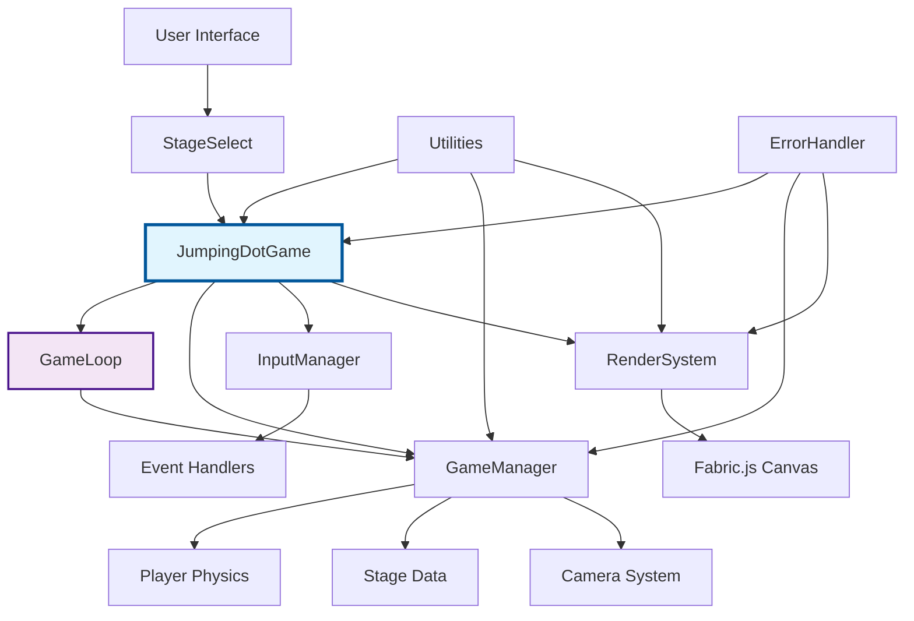
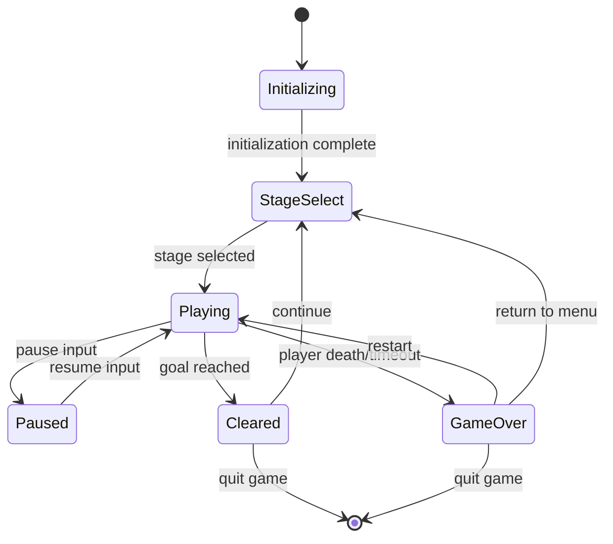
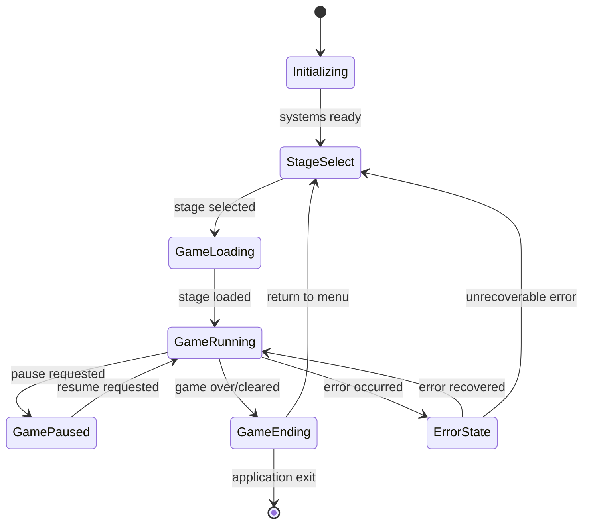

# 🏗️ Architecture Guide - Jumping Dot Game

## 📋 System Design Overview

### 🎯 Design Principles

1. **Separation of Concerns**: Clear responsibility separation using MVC-inspired patterns
2. **Type Safety**: TypeScript strict mode with comprehensive type checking
3. **Testability**: Dependency injection and comprehensive mocking support
4. **Extensibility**: Modular design for easy feature additions
5. **Performance**: Object pooling and optimized rendering
6. **Error Handling**: Unified error handling and recovery strategies

---

## 🏛️ Architecture Overview



---

## 🎮 Core Game Architecture

### Game Layer - Application Orchestration

**Responsibility**: Top-level game lifecycle management and system coordination

#### JumpingDotGame
```typescript
class JumpingDotGame {
    private gameLoop: GameLoop | null = null;
    private gameManager: GameManager | null = null;
    private inputManager: InputManager | null = null;
    private renderSystem: RenderSystem | null = null;
    
    // Lifecycle Management
    public async initWithStage(stageId: number): Promise<void>
    public start(): void
    public pause(): void
    public resume(): void
    public async cleanup(): Promise<void>
    
    // Event Coordination
    private handleGameStateChange(newState: GameState): void
    private handlePlayerDeath(): void
    private handleGoalReached(): void
}
```

**Features**:
- Centralized system initialization and cleanup
- Game state coordination between systems
- Event-driven communication between components
- Resource management and memory cleanup

### GameLoop - Fixed Timestep Engine

**Responsibility**: Consistent game timing and update/render coordination

#### GameLoop Implementation
```typescript
class GameLoop {
    private targetFPS = 60;
    private maxFrameTime = 250; // ms
    private timestep = 1000 / 60; // 16.67ms
    
    // Core Loop
    public start(): void
    public stop(): void
    private loop(timestamp: number): void
    
    // Timing
    private update(deltaTime: number): void
    private render(interpolation: number): void
    private calculateInterpolation(): number
}
```

**Optimization Features**:
- **Fixed timestep**: Consistent physics regardless of framerate
- **Interpolation**: Smooth rendering between physics updates
- **Frame limiting**: Prevents spiral of death on slow devices
- **Performance monitoring**: Real-time FPS and timing metrics

### GameManager - Game State & Logic

**Responsibility**: Game state management, physics simulation, collision detection

#### GameManager Architecture
```typescript
class GameManager {
    private player: Player;
    private stage: StageData;
    private camera: Camera;
    private gameState: GameState;
    
    // Core Game Logic
    public update(deltaTime: number): void
    public handleInput(inputState: InputState): void
    public checkCollisions(): void
    
    // State Management
    public getGameState(): GameState
    public getCurrentStage(): StageData
    public getPlayer(): Player
    public getCamera(): Camera
    
    // Game Events
    private handlePlayerGoalReached(): void
    private handlePlayerDeath(deathPosition: Point): void
    private updatePhysics(deltaTime: number): void
}
```

**Core Systems**:
- **Physics Engine**: Gravity, collision detection, platform mechanics
- **Player Controller**: Movement, jumping (including multi-jump), state management
- **Camera System**: Smooth following, boundary constraints
- **Stage Management**: Level loading, moving platform updates

---

## 🎨 Rendering System Architecture

### Hierarchy Structure

```
RenderSystem (Abstract Base)
├── FabricRenderSystem (Fabric.js Integration)
└── MockRenderSystem (Testing Only)
```

### FabricRenderSystem Design

```typescript
class FabricRenderSystem {
    protected canvas: fabric.Canvas;
    private objectPools: Map<string, ObjectPool>;
    
    // Core Rendering
    public renderPlayer(player: Player): void
    public renderStage(stage: StageData): void
    public renderTrail(trail: TrailPoint[]): void
    public applyCameraTransform(camera: Camera): void
    
    // Performance Optimization
    private reuseObjects(type: string): fabric.Object
    private cleanupUnusedObjects(): void
    
    // Visual Effects
    public renderDeathAnimation(particles: Particle[]): void
    public renderClearAnimation(particles: Particle[]): void
    public renderLandingPredictions(): void
}
```

**Optimization Strategies**:
- **Object Reuse**: Fabric.js object pooling to reduce GC pressure
- **Batch Updates**: Multiple object updates in single render call
- **Selective Rendering**: Only update changed objects
- **Memory Management**: Proper cleanup and disposal patterns

---

## 🗂️ State Management System

### Game State Structure

```typescript
interface GameState {
    // Core State
    currentStage: number;
    playerPosition: Point;
    playerVelocity: Point;
    cameraPosition: Point;
    
    // Game Flow
    gamePhase: GamePhase; // 'playing' | 'paused' | 'gameOver' | 'cleared'
    timeElapsed: number;
    score: number;
    deathCount: number;
    
    // Player State
    jumpCount: number;
    maxJumps: number;
    isOnGround: boolean;
    isMovingPlatform: boolean;
    
    // Effects
    trailPoints: TrailPoint[];
    particles: Particle[];
    deathMarks: DeathMark[];
}
```

### State Flow Management



---

## 🛠️ Utility Systems

### Design Patterns

#### Helper Classes
```typescript
// Mathematical utilities
class MathHelper {
    static distance(p1: Point, p2: Point): number
    static clamp(value: number, min: number, max: number): number
    static lerp(a: number, b: number, t: number): number
    static easeInOut(t: number): number
}

// Collision detection utilities  
class CollisionHelper {
    static pointInRect(point: Point, rect: Rectangle): boolean
    static lineIntersection(line1: Line, line2: Line): Point | null
    static circleRectCollision(circle: Circle, rect: Rectangle): boolean
}

// Animation utilities
class AnimationHelper {
    static easeInOutCubic(t: number): number
    static spring(current: number, target: number, velocity: number, damping: number): { position: number, velocity: number }
}
```

#### Factory Pattern
```typescript
class ParticleFactory {
    static createDeathParticle(position: Point): Particle
    static createClearParticle(position: Point): Particle
    static createTrailPoint(position: Point, age: number): TrailPoint
    
    private static applyCommonProperties(particle: Particle): void
    private static randomizeVelocity(): Point
}
```

---

## 🚀 Performance Optimization

### Object Pool Pattern

```typescript
class ObjectPool<T> {
    private available: T[] = [];
    private inUse = new Set<T>();
    private createFn: () => T;
    private resetFn: (object: T) => void;
    
    public acquire(): T
    public release(object: T): void
    public getStats(): PoolStats
    
    private expandPool(): void
    private validateObject(object: T): boolean
}

// Specialized pools
class ParticlePool extends ObjectPool<Particle> {
    constructor() {
        super(
            () => ({ x: 0, y: 0, vx: 0, vy: 0, life: 1, size: 2 }),
            (particle) => { particle.life = 1; particle.x = particle.y = 0; }
        );
    }
}
```

### Performance Monitoring

```typescript
class PerformanceMonitor {
    private frameTimings: number[] = [];
    private updateTimings: number[] = [];
    private renderTimings: number[] = [];
    
    public startFrame(): void
    public endFrame(): void
    public measureUpdate<T>(operation: () => T): T
    public measureRender<T>(operation: () => T): T
    public getStats(): PerformanceStats
    
    private calculateAverages(): TimingAverages
    private detectPerformanceIssues(): PerformanceWarning[]
}
```

### Optimization Metrics

| Metric | Target | Measurement Method |
|--------|--------|--------------------|
| FPS | 60fps stable | `requestAnimationFrame` timing |
| Update Time | <10ms | Performance API profiling |
| Render Time | <6ms | Canvas operation timing |
| Memory Usage | <30MB | `performance.memory` |
| GC Frequency | <1/sec | Memory allocation tracking |

---

## 🛡️ Error Handling & Recovery

### Error Classification

```typescript
// Base error class
class GameError extends Error {
    constructor(
        message: string,
        public readonly code: ErrorCode,
        public readonly recoverable: boolean = true,
        public readonly details?: any
    ) {
        super(message);
        this.name = 'GameError';
    }
}

// Specialized errors
class RenderError extends GameError {
    constructor(message: string, details?: any) {
        super(message, ERROR_CODES.RENDER_FAILED, true, details);
    }
}

class PhysicsError extends GameError {
    constructor(message: string, details?: any) {
        super(message, ERROR_CODES.PHYSICS_CALCULATION_FAILED, true, details);
    }
}
```

### Recovery Strategies

```typescript
class ErrorRecoveryManager {
    private errorHistory: GameError[] = [];
    private recoveryStrategies: Map<ErrorCode, RecoveryStrategy>;
    
    public handleError(error: GameError): boolean
    public addRecoveryStrategy(code: ErrorCode, strategy: RecoveryStrategy): void
    public getErrorStats(): ErrorStatistics
    
    private attemptRecovery(error: GameError): boolean
    private logError(error: GameError): void
    private shouldRetry(error: GameError): boolean
}
```

### Recovery Actions

1. **Render Errors**: Reinitialize canvas, fallback to simple shapes
2. **Physics Errors**: Reset player to safe position, recalculate state
3. **Input Errors**: Reset input state, ignore malformed events
4. **Memory Errors**: Force garbage collection, clear object pools

---

## 🧪 Testing Architecture

### Test Organization

#### Unit Tests
```typescript
describe('GameManager', () => {
    let gameManager: GameManager;
    let mockRenderSystem: MockRenderSystem;
    
    beforeEach(() => {
        mockRenderSystem = new MockRenderSystem();
        gameManager = new GameManager(mockRenderSystem);
    });
    
    it('should handle player movement correctly', () => {
        const inputState = { left: false, right: true, jump: false };
        gameManager.handleInput(inputState);
        gameManager.update(16.67); // One frame
        
        const player = gameManager.getPlayer();
        expect(player.velocity.x).toBeGreaterThan(0);
    });
});
```

#### Integration Tests
```typescript
describe('Game Integration', () => {
    let game: JumpingDotGame;
    let mockCanvas: HTMLCanvasElement;
    
    beforeEach(async () => {
        mockCanvas = createMockCanvas();
        game = new JumpingDotGame();
        await game.initWithStage(1);
    });
    
    it('should complete full game cycle', async () => {
        // Test full gameplay loop
        game.start();
        
        // Simulate player reaching goal
        const gameManager = game.getGameManager();
        gameManager.testMovePlayerToGoal();
        
        // Verify game completion state
        expect(gameManager.getGameState().gamePhase).toBe('cleared');
    });
});
```

#### Performance Tests
```typescript
describe('Performance Tests', () => {
    it('should maintain stable framerate', async () => {
        const performanceMonitor = new PerformanceMonitor();
        const game = new JumpingDotGame();
        
        performanceMonitor.startFrame();
        
        // Simulate 1 second of gameplay
        for (let i = 0; i < 60; i++) {
            game.update(16.67);
            game.render(1.0);
        }
        
        performanceMonitor.endFrame();
        const stats = performanceMonitor.getStats();
        
        expect(stats.averageFPS).toBeGreaterThanOrEqual(58);
        expect(stats.averageUpdateTime).toBeLessThan(10);
    });
});
```

### Mocking Strategy

```typescript
// Canvas mocking for headless testing
const createMockCanvas = (): HTMLCanvasElement => {
    const canvas = document.createElement('canvas');
    canvas.getContext = vi.fn().mockReturnValue({
        fillRect: vi.fn(),
        clearRect: vi.fn(),
        drawImage: vi.fn(),
        // ... other context methods
    });
    return canvas;
};

// Fabric.js mocking
vi.mock('fabric', () => ({
    Canvas: vi.fn().mockImplementation(() => ({
        add: vi.fn(),
        remove: vi.fn(),
        renderAll: vi.fn(),
        setViewportTransform: vi.fn(),
        dispose: vi.fn().mockResolvedValue(undefined),
        // ... other fabric methods
    })),
    Circle: vi.fn().mockImplementation(() => ({})),
    Line: vi.fn().mockImplementation(() => ({})),
    Polygon: vi.fn().mockImplementation(() => ({}))
}));
```

---

## 🔌 Extension Points

### Custom Stage Creation

```typescript
interface CustomStageLoader {
    loadStage(id: number): Promise<StageData>;
    validateStage(stage: StageData): boolean;
    saveStage(stage: StageData): Promise<void>;
}

class FileStageLoader implements CustomStageLoader {
    async loadStage(id: number): Promise<StageData> {
        const response = await fetch(`/stages/stage${id}.json`);
        return response.json();
    }
    
    validateStage(stage: StageData): boolean {
        return stage.id > 0 && stage.platforms.length > 0;
    }
    
    async saveStage(stage: StageData): Promise<void> {
        // Custom save implementation
    }
}
```

### Custom Physics Behaviors

```typescript
interface PhysicsBehavior {
    applyForces(player: Player, deltaTime: number): void;
    checkCollisions(player: Player, stage: StageData): CollisionResult[];
}

class CustomGravityBehavior implements PhysicsBehavior {
    private gravityStrength: number;
    
    applyForces(player: Player, deltaTime: number): void {
        player.velocity.y += this.gravityStrength * deltaTime;
    }
    
    checkCollisions(player: Player, stage: StageData): CollisionResult[] {
        // Custom collision logic
        return [];
    }
}
```

---

## 📊 Monitoring & Metrics

### Real-time Monitoring

```typescript
class GameMetrics {
    private metrics = new Map<string, number>();
    private eventLog: GameEvent[] = [];
    
    public recordMetric(name: string, value: number): void
    public recordEvent(event: GameEvent): void
    public getMetricSummary(): MetricSummary
    public getEventHistory(timeRange?: TimeRange): GameEvent[]
    
    private aggregateMetrics(): AggregatedMetrics
    private detectAnomalies(): Anomaly[]
}
```

### Debug Information

```typescript
class DebugOverlay {
    private isVisible = false;
    private debugData: DebugData;
    
    public toggle(): void
    public update(gameManager: GameManager): void
    public render(context: CanvasRenderingContext2D): void
    
    private renderFPSGraph(): void
    private renderPlayerInfo(): void
    private renderPhysicsDebug(): void
}
```

---

## 🔄 Lifecycle Management

### Application Lifecycle



### Resource Management

```typescript
interface Disposable {
    dispose(): Promise<void>;
}

class ResourceManager {
    private resources: Disposable[] = [];
    
    public register(resource: Disposable): void
    public async disposeAll(): Promise<void>
    public async disposeResource(resource: Disposable): Promise<void>
    
    private setupCleanupHooks(): void
}

// Automatic cleanup on page unload
window.addEventListener('beforeunload', async () => {
    await globalResourceManager.disposeAll();
});
```

---

## 🎯 Architecture Benefits

### Maintainability
- **Clear separation of concerns**: Each system has distinct responsibilities
- **Dependency inversion**: Systems depend on abstractions, not concretions
- **Testable design**: Easy to mock and test individual components

### Performance
- **Efficient rendering**: Object pooling and selective updates
- **Fixed timestep**: Consistent physics regardless of framerate
- **Memory management**: Proactive cleanup and resource management

### Extensibility
- **Plugin architecture**: Easy to add new behaviors and systems
- **Event-driven design**: Loose coupling between components
- **Configuration-driven**: Game parameters easily adjustable

### Reliability
- **Comprehensive error handling**: Graceful degradation and recovery
- **Type safety**: TypeScript prevents many runtime errors
- **Thorough testing**: Unit, integration, and performance tests

---

This architecture provides a solid foundation for a high-quality, maintainable jumping game while remaining flexible enough for future enhancements and customizations.